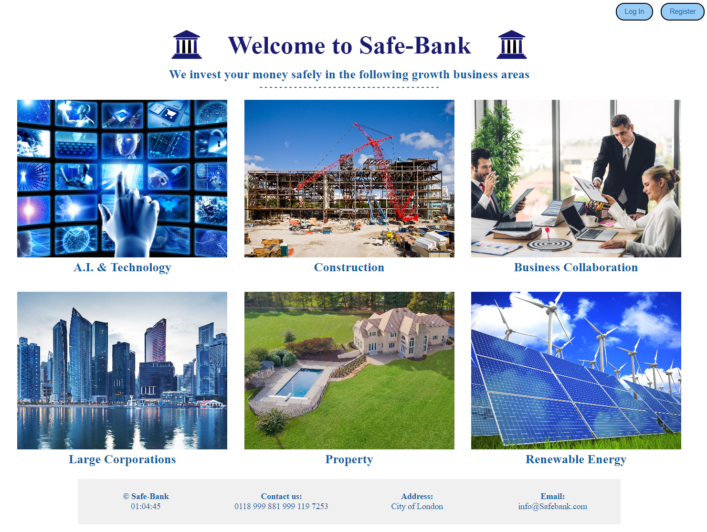

# Safe - Bank
## About
A secure online bank where you can create a secure login and secure accounts, then make payments, transfers and withdrawals. 

**** NOT A REAL BANK***

Built using JavaScript, React with the React-Router & CSS for the Front-End.\
Oh, and I used Zustand for Global State.\
The Node.JS Back-End is Hosted on Heroku.com and I used the Express-Router to deliver JSON responses, \
BCrypt for encrypted passwords, JSON-Webtoken for user login authorisation & authentication. \
I also used Prisma to connect to the PostgreSQL Database that is hosted on Elephantsql.com

  

## How to build this app
mkdir safe-bank \
cd safe-bank \
git clone https://github.com/sydneymurray/boolean-uk-solo-project-client-deployment.git \
npm install

## Start front end
Ensure that your .env files contains:- \
REACT_APP_API_URL = http://backend-location \
npm run start

## Please Note
Backend GitHub located at:- \
https://github.com/sydneymurray/boolean-uk-solo-project-server-deployment